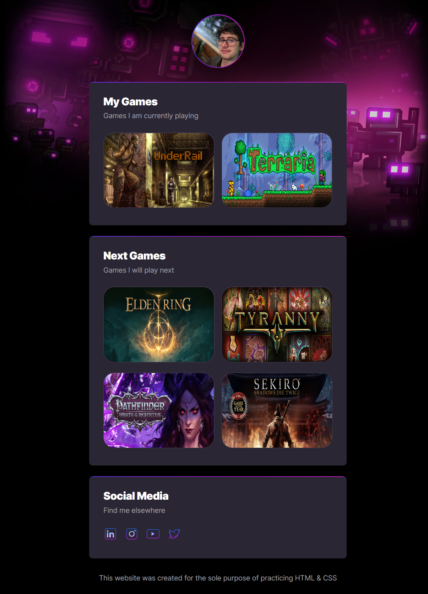

# Projeto WEB

> Trilha Explorer

Projeto construído com o objetivo de praticar HTML e CSS.

## Tecnologias

- HTML
- CSS
- Git e Github
- VScode

## Visualização

> Links para redes sociais foram adicionados apenas como demonstração. Somente minha foto (Github) no topo da página e o ícone do Linkedin vão redirecionar para meus perfis.

> [Clique aqui visualizar](https://mat-p1.github.io/ProjetoWeb/)

